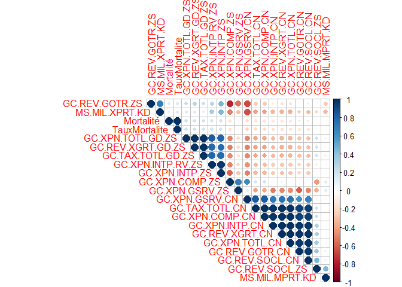
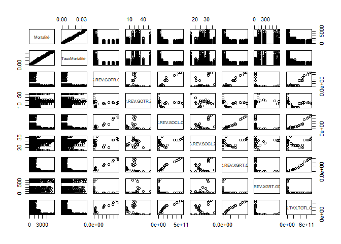
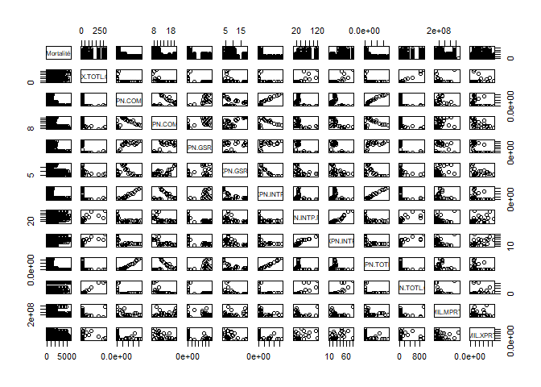
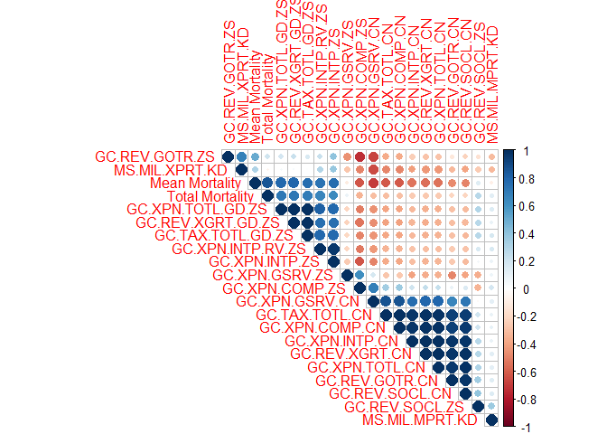
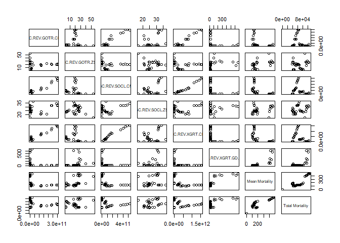
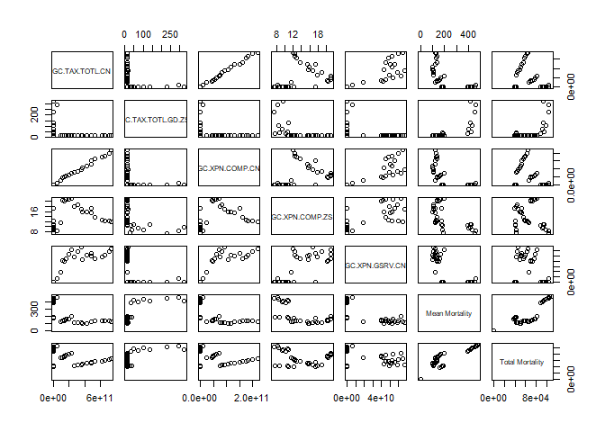
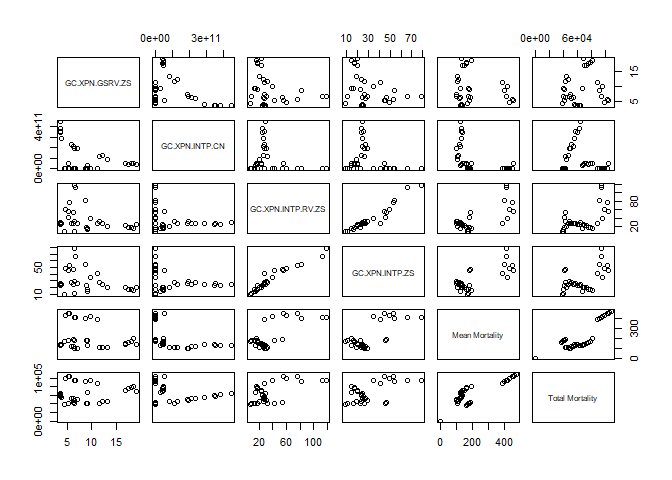
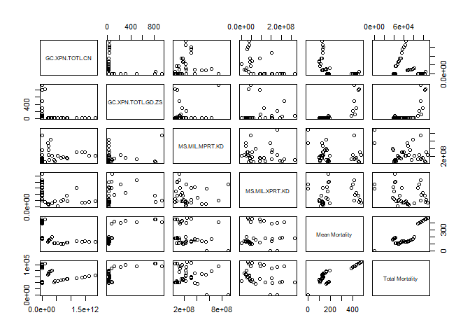

Analyse mortalité x secteur public
================

Afin de pouvoir étudier l'influence des indicateurs sur le secteur public, on détermine d'abord les indicateurs que l'on va étudier. Dans un premier temps on regarde, le nombre de valeurs manquantes pour chacune des variables. En effet si le nombre de valeurs manquantes est trop important, il n'est pas pertinent de conserver la variable.

On crée une fonction qui calcule le nombre de valeurs manquantes pour toutes les variables :

``` r
load(file="~/PST.RData")
## création du dataframe à remplir
PS_NA<- data.frame(matrix(ncol = 4, nrow = 0))
colnames(PS_NA)<-c("Code","Nom","Nombre de NA","% de NA")
for (i in 1:nrow(PublicSector)) ## Poverty = dataset des indicateurs de pauvreté et leur signification
  {
      ### Calcul de NA
      code=PublicSector[i,3]
      nbNA=sum(is.na(WorldBank[[toString(code)]]))
      PS_NA[i,]<-list(toString(code),toString(PublicSector[i,4]),nbNA,nbNA/46*100)
}
##Affichage du résultat
library(knitr)
kable(PS_NA,caption="Valeurs manquantes pour les variables Pauvreté")
```

| Code              | Nom                                                                                             |  Nombre de NA|    % de NA|
|:------------------|:------------------------------------------------------------------------------------------------|-------------:|----------:|
| GC.AST.TOTL.CN    | Net acquisition of financial assets (current LCU)                                               |            36|   78.26087|
| GC.AST.TOTL.GD.ZS | Net acquisition of financial assets (% of GDP)                                                  |            36|   78.26087|
| GC.DOD.TOTL.CN    | Central government debt, total (current LCU)                                                    |            36|   78.26087|
| GC.DOD.TOTL.GD.ZS | Central government debt, total (% of GDP)                                                       |            36|   78.26087|
| GC.LBL.TOTL.CN    | Net incurrence of liabilities, total (current LCU)                                              |            36|   78.26087|
| GC.LBL.TOTL.GD.ZS | Net incurrence of liabilities, total (% of GDP)                                                 |            36|   78.26087|
| GC.NFN.TOTL.CN    | Net investment in nonfinancial assets (current LCU)                                             |            16|   34.78261|
| GC.NFN.TOTL.GD.ZS | Net investment in nonfinancial assets (% of GDP)                                                |            16|   34.78261|
| GC.NLD.TOTL.CN    | Net lending (+) / net borrowing (-) (current LCU)                                               |            16|   34.78261|
| GC.NLD.TOTL.GD.ZS | Net lending (+) / net borrowing (-) (% of GDP)                                                  |            16|   34.78261|
| GC.REV.GOTR.CN    | Grants and other revenue (current LCU)                                                          |            12|   26.08696|
| GC.REV.GOTR.ZS    | Grants and other revenue (% of revenue)                                                         |            12|   26.08696|
| GC.REV.SOCL.CN    | Social contributions (current LCU)                                                              |            12|   26.08696|
| GC.REV.SOCL.ZS    | Social contributions (% of revenue)                                                             |            12|   26.08696|
| GC.REV.XGRT.CN    | Revenue, excluding grants (current LCU)                                                         |            12|   26.08696|
| GC.REV.XGRT.GD.ZS | Revenue, excluding grants (% of GDP)                                                            |            12|   26.08696|
| GC.TAX.EXPT.CN    | Taxes on exports (current LCU)                                                                  |            41|   89.13043|
| GC.TAX.EXPT.ZS    | Taxes on exports (% of tax revenue)                                                             |            42|   91.30435|
| GC.TAX.GSRV.CN    | Taxes on goods and services (current LCU)                                                       |            22|   47.82609|
| GC.TAX.GSRV.RV.ZS | Taxes on goods and services (% of revenue)                                                      |            23|   50.00000|
| GC.TAX.GSRV.VA.ZS | Taxes on goods and services (% value added of industry and services)                            |            22|   47.82609|
| GC.TAX.IMPT.CN    | Customs and other import duties (current LCU)                                                   |            24|   52.17391|
| GC.TAX.IMPT.ZS    | Customs and other import duties (% of tax revenue)                                              |            25|   54.34783|
| GC.TAX.INTT.CN    | Taxes on international trade (current LCU)                                                      |            22|   47.82609|
| GC.TAX.INTT.RV.ZS | Taxes on international trade (% of revenue)                                                     |            23|   50.00000|
| GC.TAX.OTHR.CN    | Other taxes (current LCU)                                                                       |            22|   47.82609|
| GC.TAX.OTHR.RV.ZS | Other taxes (% of revenue)                                                                      |            23|   50.00000|
| GC.TAX.TOTL.CN    | Tax revenue (current LCU)                                                                       |            12|   26.08696|
| GC.TAX.TOTL.GD.ZS | Tax revenue (% of GDP)                                                                          |            12|   26.08696|
| GC.TAX.YPKG.CN    | Taxes on income, profits and capital gains (current LCU)                                        |            22|   47.82609|
| GC.TAX.YPKG.RV.ZS | Taxes on income, profits and capital gains (% of revenue)                                       |            23|   50.00000|
| GC.TAX.YPKG.ZS    | Taxes on income, profits and capital gains (% of total taxes)                                   |            23|   50.00000|
| GC.XPN.COMP.CN    | Compensation of employees (current LCU)                                                         |            12|   26.08696|
| GC.XPN.COMP.ZS    | Compensation of employees (% of expense)                                                        |            12|   26.08696|
| GC.XPN.GSRV.CN    | Goods and services expense (current LCU)                                                        |            12|   26.08696|
| GC.XPN.GSRV.ZS    | Goods and services expense (% of expense)                                                       |            12|   26.08696|
| GC.XPN.INTP.CN    | Interest payments (current LCU)                                                                 |            12|   26.08696|
| GC.XPN.INTP.RV.ZS | Interest payments (% of revenue)                                                                |            12|   26.08696|
| GC.XPN.INTP.ZS    | Interest payments (% of expense)                                                                |            12|   26.08696|
| GC.XPN.OTHR.CN    | Other expense (current LCU)                                                                     |            31|   67.39130|
| GC.XPN.OTHR.ZS    | Other expense (% of expense)                                                                    |            31|   67.39130|
| GC.XPN.TOTL.CN    | Expense (current LCU)                                                                           |            12|   26.08696|
| GC.XPN.TOTL.GD.ZS | Expense (% of GDP)                                                                              |            12|   26.08696|
| GC.XPN.TRFT.CN    | Subsidies and other transfers (current LCU)                                                     |            21|   45.65217|
| GC.XPN.TRFT.ZS    | Subsidies and other transfers (% of expense)                                                    |            21|   45.65217|
| IQ.CPA.BREG.XQ    | CPIA business regulatory environment rating (1=low to 6=high)                                   |            46|  100.00000|
| IQ.CPA.DEBT.XQ    | CPIA debt policy rating (1=low to 6=high)                                                       |            46|  100.00000|
| IQ.CPA.ECON.XQ    | CPIA economic management cluster average (1=low to 6=high)                                      |            46|  100.00000|
| IQ.CPA.ENVR.XQ    | CPIA policy and institutions for environmental sustainability rating (1=low to 6=high)          |            46|  100.00000|
| IQ.CPA.FINQ.XQ    | CPIA quality of budgetary and financial management rating (1=low to 6=high)                     |            46|  100.00000|
| IQ.CPA.FINS.XQ    | CPIA financial sector rating (1=low to 6=high)                                                  |            46|  100.00000|
| IQ.CPA.FISP.XQ    | CPIA fiscal policy rating (1=low to 6=high)                                                     |            46|  100.00000|
| IQ.CPA.GNDR.XQ    | CPIA gender equality rating (1=low to 6=high)                                                   |            46|  100.00000|
| IQ.CPA.HRES.XQ    | CPIA building human resources rating (1=low to 6=high)                                          |            46|  100.00000|
| IQ.CPA.IRAI.XQ    | IDA resource allocation index (1=low to 6=high)                                                 |            46|  100.00000|
| IQ.CPA.MACR.XQ    | CPIA macroeconomic management rating (1=low to 6=high)                                          |            46|  100.00000|
| IQ.CPA.PADM.XQ    | CPIA quality of public administration rating (1=low to 6=high)                                  |            46|  100.00000|
| IQ.CPA.PRES.XQ    | CPIA equity of public resource use rating (1=low to 6=high)                                     |            46|  100.00000|
| IQ.CPA.PROP.XQ    | CPIA property rights and rule-based governance rating (1=low to 6=high)                         |            46|  100.00000|
| IQ.CPA.PROT.XQ    | CPIA social protection rating (1=low to 6=high)                                                 |            46|  100.00000|
| IQ.CPA.PUBS.XQ    | CPIA public sector management and institutions cluster average (1=low to 6=high)                |            46|  100.00000|
| IQ.CPA.REVN.XQ    | CPIA efficiency of revenue mobilization rating (1=low to 6=high)                                |            46|  100.00000|
| IQ.CPA.SOCI.XQ    | CPIA policies for social inclusion/equity cluster average (1=low to 6=high)                     |            46|  100.00000|
| IQ.CPA.STRC.XQ    | CPIA structural policies cluster average (1=low to 6=high)                                      |            46|  100.00000|
| IQ.CPA.TRAD.XQ    | CPIA trade rating (1=low to 6=high)                                                             |            46|  100.00000|
| IQ.CPA.TRAN.XQ    | CPIA transparency, accountability, and corruption in the public sector rating (1=low to 6=high) |            46|  100.00000|
| IQ.SCI.MTHD       | Methodology assessment of statistical capacity (scale 0 - 100)                                  |            34|   73.91304|
| IQ.SCI.OVRL       | Overall level of statistical capacity (scale 0 - 100)                                           |            34|   73.91304|
| IQ.SCI.PRDC       | Periodicity and timeliness assessment of statistical capacity (scale 0 - 100)                   |            34|   73.91304|
| IQ.SCI.SRCE       | Source data assessment of statistical capacity (scale 0 - 100)                                  |            34|   73.91304|
| MS.MIL.MPRT.KD    | Arms imports (SIPRI trend indicator values)                                                     |             0|    0.00000|
| MS.MIL.TOTL.P1    | Armed forces personnel, total                                                                   |            18|   39.13043|
| MS.MIL.TOTL.TF.ZS | Armed forces personnel (% of total labor force)                                                 |            20|   43.47826|
| MS.MIL.XPND.CN    | Military expenditure (current LCU)                                                              |            18|   39.13043|
| MS.MIL.XPND.GD.ZS | Military expenditure (% of GDP)                                                                 |            18|   39.13043|
| MS.MIL.XPND.ZS    | Military expenditure (% of central government expenditure)                                      |            20|   43.47826|
| MS.MIL.XPRT.KD    | Arms exports (SIPRI trend indicator values)                                                     |             7|   15.21739|
| VC.BTL.DETH       | Battle-related deaths (number of people)                                                        |            46|  100.00000|
| VC.IDP.TOTL.HE    | Internally displaced persons (number, high estimate)                                            |            39|   84.78261|
| VC.IHR.PSRC.P5    | Intentional homicides (per 100,000 people)                                                      |            41|   89.13043|

On conserve les variables avec moins de 30% de valeurs manquantes, ce qui nous donne :

``` r
library(knitr)
PS_NA<-PS_NA[PS_NA$`% de NA`<=30,]
kable(PS_NA,caption="Variables restantes (NA<30%)")
```

|     | Code              | Nom                                         |  Nombre de NA|   % de NA|
|-----|:------------------|:--------------------------------------------|-------------:|---------:|
| 11  | GC.REV.GOTR.CN    | Grants and other revenue (current LCU)      |            12|  26.08696|
| 12  | GC.REV.GOTR.ZS    | Grants and other revenue (% of revenue)     |            12|  26.08696|
| 13  | GC.REV.SOCL.CN    | Social contributions (current LCU)          |            12|  26.08696|
| 14  | GC.REV.SOCL.ZS    | Social contributions (% of revenue)         |            12|  26.08696|
| 15  | GC.REV.XGRT.CN    | Revenue, excluding grants (current LCU)     |            12|  26.08696|
| 16  | GC.REV.XGRT.GD.ZS | Revenue, excluding grants (% of GDP)        |            12|  26.08696|
| 28  | GC.TAX.TOTL.CN    | Tax revenue (current LCU)                   |            12|  26.08696|
| 29  | GC.TAX.TOTL.GD.ZS | Tax revenue (% of GDP)                      |            12|  26.08696|
| 33  | GC.XPN.COMP.CN    | Compensation of employees (current LCU)     |            12|  26.08696|
| 34  | GC.XPN.COMP.ZS    | Compensation of employees (% of expense)    |            12|  26.08696|
| 35  | GC.XPN.GSRV.CN    | Goods and services expense (current LCU)    |            12|  26.08696|
| 36  | GC.XPN.GSRV.ZS    | Goods and services expense (% of expense)   |            12|  26.08696|
| 37  | GC.XPN.INTP.CN    | Interest payments (current LCU)             |            12|  26.08696|
| 38  | GC.XPN.INTP.RV.ZS | Interest payments (% of revenue)            |            12|  26.08696|
| 39  | GC.XPN.INTP.ZS    | Interest payments (% of expense)            |            12|  26.08696|
| 42  | GC.XPN.TOTL.CN    | Expense (current LCU)                       |            12|  26.08696|
| 43  | GC.XPN.TOTL.GD.ZS | Expense (% of GDP)                          |            12|  26.08696|
| 71  | MS.MIL.MPRT.KD    | Arms imports (SIPRI trend indicator values) |             0|   0.00000|
| 77  | MS.MIL.XPRT.KD    | Arms exports (SIPRI trend indicator values) |             7|  15.21739|

Il ne reste alors que les 19 variables indiquées ci-dessus.

On va donc réaliser l'analyse pour ces 19 variables. Pour cela il faut d'abord lier les deux datasets en un même dataset.

``` r
library(dplyr)
## Création d'un dataset avec uniquement les données pauvreté et l'année
ps_data<-WorldBank[,4,drop=FALSE]
  for (i in 1:nrow(PS_NA)) ## indicateur conservé
  {
      code=PS_NA[i,1]
      ps_data<-cbind(ps_data,WorldBank[toString(code)])
}
mortalityPS<-inner_join(mortalityBr,ps_data,by=c("Periode"="year"))
```

On affiche le corrélogramme :

``` r
library(corrplot)
```

    ## corrplot 0.84 loaded

``` r
corrplot(cor(mortalityPS[,c(6,8:27)],use="complete.obs"), type="upper", order="hclust")
```



Affichage des graphiques :

``` r
pairs(mortalityPS[,c(6,8:15)],na.action = na.omit)
```



``` r
pairs(mortalityPS[,c(6,16:27)],na.action = na.omit)
```



Les coefficients de corrélation sont très faibles, il n'y a donc pas a priori de relation entre ces variables et la mortalité.

``` r
mortalityPS2<-unique(mortalityPS[,c(5,9:27)])
mortalityPS2$`Mean Mortality`<-NA
mortalityPS2$`Total Mortality`<-NA
for (i in 1:nrow(mortalityPS)) {
  mortalityPS2[i,21]<-mean(mortalityPS$Mortalité[mortalityPS$Periode==mortalityPS2$Periode[i]])
  mortalityPS2[i,22]<-sum(mortalityPS$Mortalité[mortalityPS$Periode==mortalityPS2$Periode[i]])
}
mortalityPS2<-mortalityPS2[!is.na(mortalityPS2$Periode),]
```

Corélogramme :

``` r
corrplot(cor(mortalityPS2[,c(2:22)],use="complete.obs"), type="upper", order="hclust")
```

 Affichage plot :

``` r
pairs(mortalityPS2[,c(2:7,21:22)],na.action = na.omit)
```



``` r
pairs(mortalityPS2[,c(8:12,21:22)],na.action = na.omit)
```



``` r
pairs(mortalityPS2[,c(13:16,21:22)],na.action = na.omit)
```



``` r
pairs(mortalityPS2[,c(17:22)],na.action = na.omit)
```


