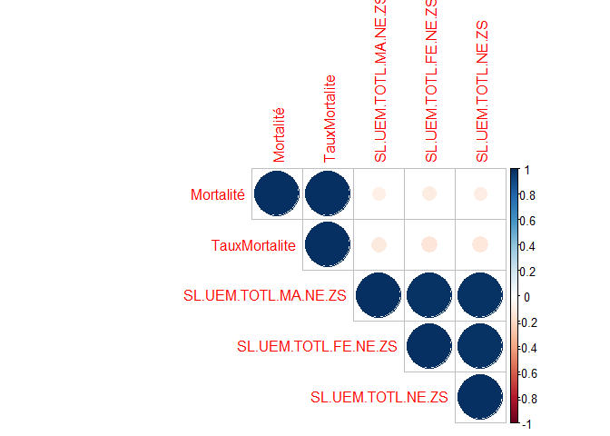
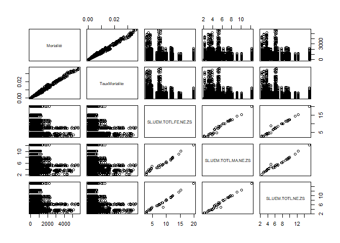
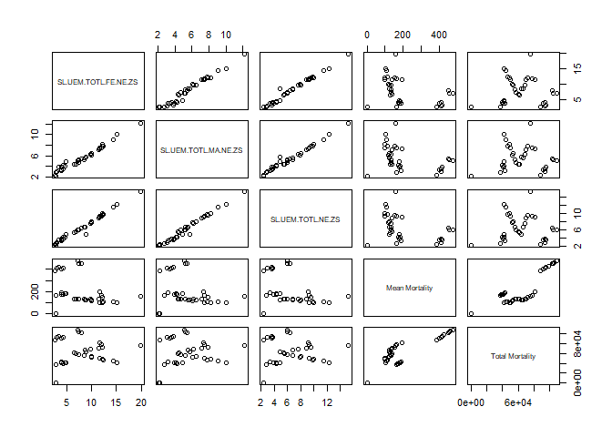
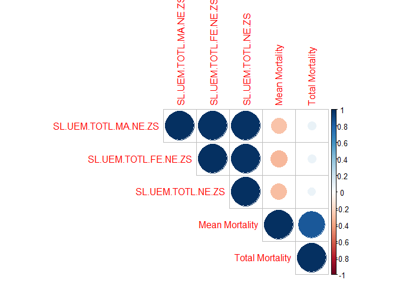

Analyse mortalité x protection sociale et travail
================

On souhaite réaliser l'étude bivariée entre la mortalité et les données de protection sociale et travail.

``` r
load(file="~/PST.RData")
SocialProtection<-Indicators[Indicators$Category=="Social Protection & Labor",]
SP_NA<- data.frame(matrix(ncol = 4, nrow = 0))
colnames(SP_NA)<-c("Code","Nom","Nombre de NA","% de NA")
for (i in 1:nrow(SocialProtection)) ## Poverty = dataset des indicateurs de pauvreté et leur signification
  {
      ### Calcul de NA
      code=SocialProtection[i,3]
      nbNA=sum(is.na(WorldBank[[toString(code)]]))
      SP_NA[i,]<-list(toString(code),toString(SocialProtection[i,4]),nbNA,nbNA/46*100)
}
##Affichage du résultat
library(knitr)
kable(SP_NA,caption="Valeurs manquantes pour les variables Pauvreté")
```

| Code                      | Nom                                                                                                              |  Nombre de NA|    % de NA|
|:--------------------------|:-----------------------------------------------------------------------------------------------------------------|-------------:|----------:|
| SL.AGR.EMPL.FE.ZS         | Employment in agriculture, female (% of female employment)                                                       |            16|   34.78261|
| SL.AGR.EMPL.MA.ZS         | Employment in agriculture, male (% of male employment)                                                           |            16|   34.78261|
| SL.AGR.EMPL.ZS            | Employment in agriculture (% of total employment)                                                                |            15|   32.60870|
| SL.EMP.1524.SP.FE.NE.ZS   | Employment to population ratio, ages 15-24, female (%) (national estimate)                                       |            41|   89.13043|
| SL.EMP.1524.SP.FE.ZS      | Employment to population ratio, ages 15-24, female (%) (modeled ILO estimate)                                    |            21|   45.65217|
| SL.EMP.1524.SP.MA.NE.ZS   | Employment to population ratio, ages 15-24, male (%) (national estimate)                                         |            41|   89.13043|
| SL.EMP.1524.SP.MA.ZS      | Employment to population ratio, ages 15-24, male (%) (modeled ILO estimate)                                      |            21|   45.65217|
| SL.EMP.1524.SP.NE.ZS      | Employment to population ratio, ages 15-24, total (%) (national estimate)                                        |            40|   86.95652|
| SL.EMP.1524.SP.ZS         | Employment to population ratio, ages 15-24, total (%) (modeled ILO estimate)                                     |            21|   45.65217|
| SL.EMP.INSV.FE.ZS         | Share of women in wage employment in the nonagricultural sector (% of total nonagricultural employment)          |            30|   65.21739|
| SL.EMP.MPYR.FE.ZS         | Employers, female (% of female employment)                                                                       |            33|   71.73913|
| SL.EMP.MPYR.MA.ZS         | Employers, male (% of male employment)                                                                           |            33|   71.73913|
| SL.EMP.MPYR.ZS            | Employers, total (% of total employment)                                                                         |            33|   71.73913|
| SL.EMP.SELF.FE.ZS         | Self-employed, female (% of female employment)                                                                   |            46|  100.00000|
| SL.EMP.SELF.MA.ZS         | Self-employed, male (% of male employment)                                                                       |            46|  100.00000|
| SL.EMP.SELF.ZS            | Self-employed, total (% of total employment)                                                                     |            46|  100.00000|
| SL.EMP.TOTL.SP.FE.NE.ZS   | Employment to population ratio, 15+, female (%) (national estimate)                                              |            31|   67.39130|
| SL.EMP.TOTL.SP.FE.ZS      | Employment to population ratio, 15+, female (%) (modeled ILO estimate)                                           |            21|   45.65217|
| SL.EMP.TOTL.SP.MA.NE.ZS   | Employment to population ratio, 15+, male (%) (national estimate)                                                |            31|   67.39130|
| SL.EMP.TOTL.SP.MA.ZS      | Employment to population ratio, 15+, male (%) (modeled ILO estimate)                                             |            21|   45.65217|
| SL.EMP.TOTL.SP.NE.ZS      | Employment to population ratio, 15+, total (%) (national estimate)                                               |            31|   67.39130|
| SL.EMP.TOTL.SP.ZS         | Employment to population ratio, 15+, total (%) (modeled ILO estimate)                                            |            21|   45.65217|
| SL.EMP.VULN.FE.ZS         | Vulnerable employment, female (% of female employment)                                                           |            33|   71.73913|
| SL.EMP.VULN.MA.ZS         | Vulnerable employment, male (% of male employment)                                                               |            33|   71.73913|
| SL.EMP.VULN.ZS            | Vulnerable employment, total (% of total employment)                                                             |            33|   71.73913|
| SL.EMP.WORK.FE.ZS         | Wage and salaried workers, female (% of female employment)                                                       |            33|   71.73913|
| SL.EMP.WORK.MA.ZS         | Wage and salaried workers, male (% of male employment)                                                           |            33|   71.73913|
| SL.EMP.WORK.ZS            | Wage and salaried workers, total (% of total employment)                                                         |            33|   71.73913|
| SL.FAM.WORK.FE.ZS         | Contributing family workers, female (% of female employment)                                                     |            33|   71.73913|
| SL.FAM.WORK.MA.ZS         | Contributing family workers, male (% of male employment)                                                         |            33|   71.73913|
| SL.FAM.WORK.ZS            | Contributing family workers, total (% of total employment)                                                       |            33|   71.73913|
| SL.GDP.PCAP.EM.KD         | GDP per person employed (constant 2011 PPP $)                                                                    |            21|   45.65217|
| SL.IND.EMPL.FE.ZS         | Employment in industry, female (% of female employment)                                                          |            16|   34.78261|
| SL.IND.EMPL.MA.ZS         | Employment in industry, male (% of male employment)                                                              |            16|   34.78261|
| SL.IND.EMPL.ZS            | Employment in industry (% of total employment)                                                                   |            14|   30.43478|
| SL.SRV.EMPL.FE.ZS         | Employment in services, female (% of female employment)                                                          |            16|   34.78261|
| SL.SRV.EMPL.MA.ZS         | Employment in services, male (% of male employment)                                                              |            16|   34.78261|
| SL.SRV.EMPL.ZS            | Employment in services (% of total employment)                                                                   |            14|   30.43478|
| SL.TLF.ACTI.1524.FE.NE.ZS | Labor force participation rate for ages 15-24, female (%) (national estimate)                                    |            18|   39.13043|
| SL.TLF.ACTI.1524.FE.ZS    | Labor force participation rate for ages 15-24, female (%) (modeled ILO estimate)                                 |            20|   43.47826|
| SL.TLF.ACTI.1524.MA.NE.ZS | Labor force participation rate for ages 15-24, male (%) (national estimate)                                      |            18|   39.13043|
| SL.TLF.ACTI.1524.MA.ZS    | Labor force participation rate for ages 15-24, male (%) (modeled ILO estimate)                                   |            20|   43.47826|
| SL.TLF.ACTI.1524.NE.ZS    | Labor force participation rate for ages 15-24, total (%) (national estimate)                                     |            17|   36.95652|
| SL.TLF.ACTI.1524.ZS       | Labor force participation rate for ages 15-24, total (%) (modeled ILO estimate)                                  |            20|   43.47826|
| SL.TLF.ADVN.FE.ZS         | Labor force with advanced education, female (% of female working-age population with advanced education)         |            41|   89.13043|
| SL.TLF.ADVN.MA.ZS         | Labor force with advanced education, male (% of male working-age population with advanced education)             |            41|   89.13043|
| SL.TLF.ADVN.ZS            | Labor force with advanced education (% of total working-age population with advanced education)                  |            40|   86.95652|
| SL.TLF.BASC.FE.ZS         | Labor force with basic education, female (% of female working-age population with basic education)               |            41|   89.13043|
| SL.TLF.BASC.MA.ZS         | Labor force with basic education, male (% of male working-age population with basic education)                   |            41|   89.13043|
| SL.TLF.BASC.ZS            | Labor force with basic education (% of total working-age population with basic education)                        |            40|   86.95652|
| SL.TLF.CACT.FE.NE.ZS      | Labor force participation rate, female (% of female population ages 15+) (national estimate)                     |            14|   30.43478|
| SL.TLF.CACT.FE.ZS         | Labor force participation rate, female (% of female population ages 15+) (modeled ILO estimate)                  |            20|   43.47826|
| SL.TLF.CACT.FM.NE.ZS      | Ratio of female to male labor force participation rate (%) (national estimate)                                   |            14|   30.43478|
| SL.TLF.CACT.FM.ZS         | Ratio of female to male labor force participation rate (%) (modeled ILO estimate)                                |            20|   43.47826|
| SL.TLF.CACT.MA.NE.ZS      | Labor force participation rate, male (% of male population ages 15+) (national estimate)                         |            14|   30.43478|
| SL.TLF.CACT.MA.ZS         | Labor force participation rate, male (% of male population ages 15+) (modeled ILO estimate)                      |            20|   43.47826|
| SL.TLF.CACT.NE.ZS         | Labor force participation rate, total (% of total population ages 15+) (national estimate)                       |            14|   30.43478|
| SL.TLF.CACT.ZS            | Labor force participation rate, total (% of total population ages 15+) (modeled ILO estimate)                    |            20|   43.47826|
| SL.TLF.INTM.FE.ZS         | Labor force with intermediate education, female (% of female working-age population with intermediate education) |            41|   89.13043|
| SL.TLF.INTM.MA.ZS         | Labor force with intermediate education, male (% of male working-age population with intermediate education)     |            41|   89.13043|
| SL.TLF.INTM.ZS            | Labor force with intermediate education (% of total working-age population with intermediate education)          |            40|   86.95652|
| SL.TLF.TOTL.FE.ZS         | Labor force, female (% of total labor force)                                                                     |            20|   43.47826|
| SL.TLF.TOTL.IN            | Labor force, total                                                                                               |            20|   43.47826|
| SL.UEM.1524.FE.NE.ZS      | Unemployment, youth female (% of female labor force ages 15-24) (national estimate)                              |            22|   47.82609|
| SL.UEM.1524.FE.ZS         | Unemployment, youth female (% of female labor force ages 15-24) (modeled ILO estimate)                           |            21|   45.65217|
| SL.UEM.1524.MA.NE.ZS      | Unemployment, youth male (% of male labor force ages 15-24) (national estimate)                                  |            22|   47.82609|
| SL.UEM.1524.MA.ZS         | Unemployment, youth male (% of male labor force ages 15-24) (modeled ILO estimate)                               |            21|   45.65217|
| SL.UEM.1524.NE.ZS         | Unemployment, youth total (% of total labor force ages 15-24) (national estimate)                                |            21|   45.65217|
| SL.UEM.1524.ZS            | Unemployment, youth total (% of total labor force ages 15-24) (modeled ILO estimate)                             |            21|   45.65217|
| SL.UEM.ADVN.FE.ZS         | Unemployment with advanced education, female (% of female labor force with advanced education)                   |            39|   84.78261|
| SL.UEM.ADVN.MA.ZS         | Unemployment with advanced education, male (% of male labor force with advanced education)                       |            39|   84.78261|
| SL.UEM.ADVN.ZS            | Unemployment with advanced education (% of total labor force with advanced education)                            |            38|   82.60870|
| SL.UEM.BASC.FE.ZS         | Unemployment with basic education, female (% of female labor force with basic education)                         |            39|   84.78261|
| SL.UEM.BASC.MA.ZS         | Unemployment with basic education, male (% of male labor force with basic education)                             |            39|   84.78261|
| SL.UEM.BASC.ZS            | Unemployment with basic education (% of total labor force with basic education)                                  |            38|   82.60870|
| SL.UEM.INTM.FE.ZS         | Unemployment with intermediate education, female (% of female labor force with intermediate education)           |            39|   84.78261|
| SL.UEM.INTM.MA.ZS         | Unemployment with intermediate education, male (% of male labor force with intermediate education)               |            39|   84.78261|
| SL.UEM.INTM.ZS            | Unemployment with intermediate education (% of total labor force with intermediate education)                    |            38|   82.60870|
| SL.UEM.NEET.FE.ZS         | Share of youth not in education, employment or training, female (% of female youth population)                   |            41|   89.13043|
| SL.UEM.NEET.MA.ZS         | Share of youth not in education, employment or training, male (% of male youth population)                       |            41|   89.13043|
| SL.UEM.NEET.ZS            | Share of youth not in education, employment or training, total (% of youth population)                           |            41|   89.13043|
| SL.UEM.TOTL.FE.NE.ZS      | Unemployment, female (% of female labor force) (national estimate)                                               |             9|   19.56522|
| SL.UEM.TOTL.FE.ZS         | Unemployment, female (% of female labor force) (modeled ILO estimate)                                            |            21|   45.65217|
| SL.UEM.TOTL.MA.NE.ZS      | Unemployment, male (% of male labor force) (national estimate)                                                   |             9|   19.56522|
| SL.UEM.TOTL.MA.ZS         | Unemployment, male (% of male labor force) (modeled ILO estimate)                                                |            21|   45.65217|
| SL.UEM.TOTL.NE.ZS         | Unemployment, total (% of total labor force) (national estimate)                                                 |             8|   17.39130|
| SL.UEM.TOTL.ZS            | Unemployment, total (% of total labor force) (modeled ILO estimate)                                              |            21|   45.65217|
| SM.POP.NETM               | Net migration                                                                                                    |            37|   80.43478|
| SM.POP.REFG               | Refugee population by country or territory of asylum                                                             |            20|   43.47826|
| SM.POP.REFG.OR            | Refugee population by country or territory of origin                                                             |            20|   43.47826|
| SM.POP.TOTL               | International migrant stock, total                                                                               |            36|   78.26087|
| SM.POP.TOTL.ZS            | International migrant stock (% of population)                                                                    |            40|   86.95652|

On restreint aux variables contenant au moins 70% des données.

``` r
SP_NA<-SP_NA[SP_NA$`% de NA`<=30,]
kable(SP_NA,caption="Variables restantes (NA<30%)")
```

|     | Code                 | Nom                                                                |  Nombre de NA|   % de NA|
|-----|:---------------------|:-------------------------------------------------------------------|-------------:|---------:|
| 82  | SL.UEM.TOTL.FE.NE.ZS | Unemployment, female (% of female labor force) (national estimate) |             9|  19.56522|
| 84  | SL.UEM.TOTL.MA.NE.ZS | Unemployment, male (% of male labor force) (national estimate)     |             9|  19.56522|
| 86  | SL.UEM.TOTL.NE.ZS    | Unemployment, total (% of total labor force) (national estimate)   |             8|  17.39130|

On calcule donc les coefficients de corrélation pour ces 3 variables :

``` r
library(dplyr)
```

    ## 
    ## Attaching package: 'dplyr'

    ## The following objects are masked from 'package:stats':
    ## 
    ##     filter, lag

    ## The following objects are masked from 'package:base':
    ## 
    ##     intersect, setdiff, setequal, union

``` r
## Création d'un dataset avec uniquement les données pauvreté et l'année
sp_data<-WorldBank[,4,drop=FALSE]
  for (i in 1:nrow(SP_NA)) ## indicateur conservé
  {
      code=SP_NA[i,1]
      sp_data<-cbind(sp_data,WorldBank[toString(code)])
}
mortalitySP<-inner_join(mortalityBr,sp_data,by=c("Periode"="year"))
```

On affiche le corrélogramme :

``` r
library(corrplot)
```

    ## corrplot 0.84 loaded

``` r
corrplot(cor(mortalitySP[,c(6,8:11)],use="complete.obs"), type="upper", order="hclust")
```

 On constate donc qu'il n'y a pas de corrélation entre les variables et la mortalité.

``` r
pairs(mortalitySP[,c(6,8:11)],na.action = na.omit)
```



Création d'une valeur moyenne de la mortalité sur l'année :

``` r
mortalitySP2<-unique(mortalitySP[,c(5,9:11)])
mortalitySP2$`Mean Mortality`<-NA
mortalitySP2$`Total Mortality`<-NA
for (i in 1:nrow(mortalitySP)) {
  mortalitySP2[i,5]<-mean(mortalitySP$Mortalité[mortalitySP$Periode==mortalitySP2$Periode[i]])
  mortalitySP2[i,6]<-sum(mortalitySP$Mortalité[mortalitySP$Periode==mortalitySP2$Periode[i]])
}
mortalitySP2<-mortalitySP2[!is.na(mortalitySP2$Periode),]
```

On affiche à nouveau le graphique de relation :

``` r
pairs(mortalitySP2[,c(2:6)],na.action = na.omit)
```



Le corélogramme :

``` r
corrplot(cor(mortalitySP2[,c(2:6)],use="complete.obs"), type="upper", order="hclust")
```


